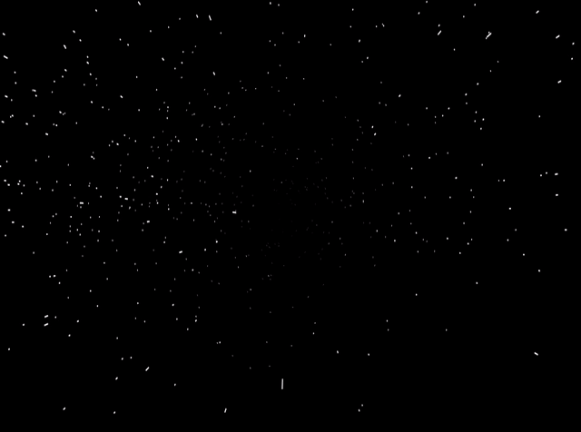

# _<s>&nbsp;&nbsp;S</s>uperlumina<s>l&nbsp;&nbsp;</s>_

## *Try it out [here](tomasr8.github.io/superluminal)*.

### Explanation

I wanted to make a simulation of stars flying by as you travel through space at high speeds but I didn't want to deal with actual 3d rendering and WebGL since I know very little about that.

Instead, I model a fast moving star as a simple line. This is actually what you're seeing - just lines on a 2d canvas. Using a camera projection matrix (nicely explained [here](https://staff.fnwi.uva.nl/r.vandenboomgaard/IPCV20162017/LectureNotes/CV/PinholeCamera/PinholeCamera.html)), the line (or rather, its start and end point) is projected to 2d and drawn on the canvas.

Check the code for more details ;)
